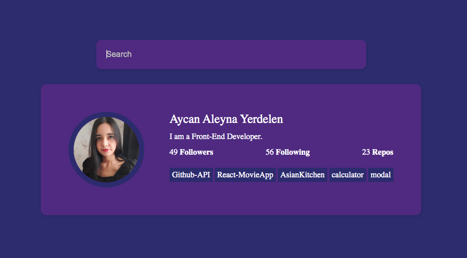

# Github-API

[Click to see](https://ayerdelen.github.io/Github-API)

- This is a tutorial of [Traversy Media](https://50projects50days.com/projects/github-profiles/)

## I've learned:

- Fetching Api,
- Async functions,
- Filter, map methods,
- Dynamic Html Sites,
- Removing commas from string

